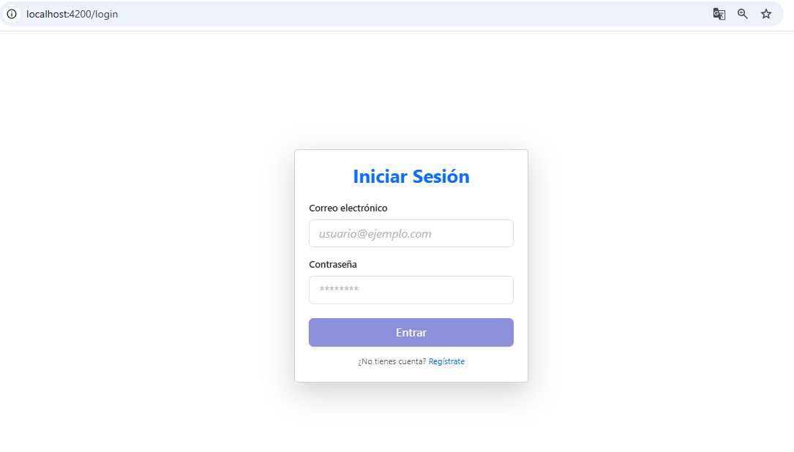
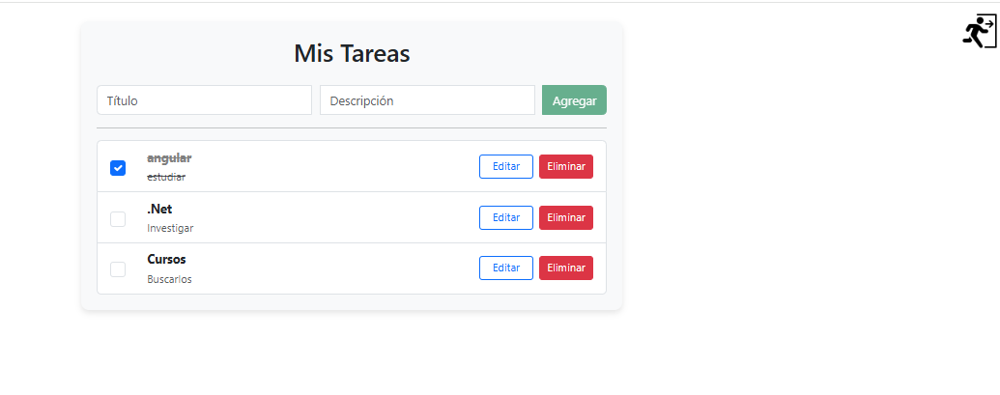
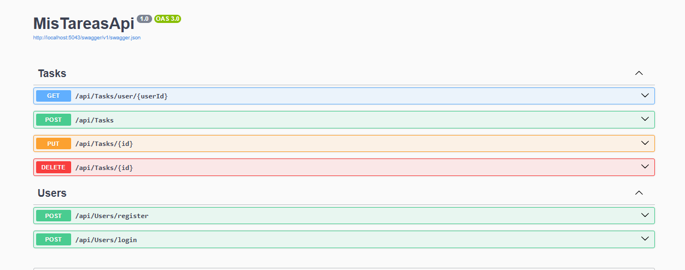

# MisTareasApp

Aplicación web para gestionar tareas personales, con frontend en Angular y backend en .NET.

---

## Tecnologías usadas

- Angular (frontend)
- .NET (backend)
- Bootstrap (estilos)
- Git / GitHub (control de versiones)

---

## Descripción

Esta aplicación permite al usuario:

- Crear, editar y eliminar tareas.
- Marcar tareas como completadas.
- Autenticación simple con login y logout.
- Almacenamiento de tareas asociado al usuario.

---

## Instalación y uso local

### Requisitos previos

- Node.js y npm instalados
- .NET SDK instalado

### Backend

1. Abrir la carpeta `backend/MisTareasApi`
2. Ejecutar en consola:
3. El backend estará corriendo en `http://localhost:5000` (o el puerto que uses).

### Frontend

1. Abrir la carpeta `frontend`
2. Ejecutar en consola:

---

## Capturas

  

